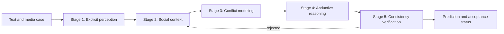

# MoCA: Implicit Social Context Analysis

MoCA is a lightweight reference implementation for analyzing implicit social meaning from multimodal inputs. A case is represented as a structured tuple containing a scenario, explicit evidence, a candidate subject, a target, a social mechanism, and a latent social label.

The repository exposes the reasoning contracts, prompt templates, data schemas, sample cases, and a command-line runner.

## Overview

MoCA organizes implicit social reasoning into five stages:



1. **Explicit perception** records text and optional speech captions without assigning social meaning.
2. **Social context** formulates retrieval questions and organizes evidence into `fact`, `connection`, and `social_norm` fields.
3. **Conflict modeling** identifies the deviation between contextual expectation and explicit reality.
4. **Abductive reasoning** recovers the subject, target, mechanism, and latent label from the conflict.
5. **Consistency verification** checks evidence, context, and mechanism alignment. Rejected cases can be revisited for a configurable number of revision rounds.

The prompt contracts for these stages are defined in [`src/prompts.py`](src/prompts.py), and the pipeline orchestration is in [`src/pipeline.py`](src/pipeline.py).

## Repository structure

```text
MoCA/
├── src/
│   ├── agents.py       # Agent specifications
│   ├── cli.py          # Command-line entry point
│   ├── pipeline.py     # Five-stage reasoning pipeline
│   ├── prompts.py      # Stage-specific instruction templates
│   ├── schemas.py      # Input, intermediate-artifact, and output schemas
│   ├── taxonomy.py     # Scenario-specific taxonomy definitions
│   └── tools.py        # Runtime utility helpers
├── samples/
│   └── samples.json    # Example cases covering affection, intent, and stance
└── sample_assets/
    ├── affection/      # Image examples
    ├── intent/         # Video/audio examples
    └── stance/         # Image and video/audio examples
```

## Input format

The input file may contain a single JSON object or a JSON list. Each case follows this structure:

```json
{
  "id": "demo_001",
  "input": {
    "scenario": "affection",
    "text": "when the bass drops just right"
  },
  "options": {
    "subject": ["poster", "photographer", "dancer"],
    "target": ["the bass drop", "dance move", "crowd reaction"]
  },
  "ground_truth": {
    "subject": "poster",
    "target": "the bass drop",
    "mechanism": "figurative_semantics",
    "label": "Happy"
  }
}
```

The schema accepts the following scenario values:

- `affection`
- `intent`
- `stance`

`ground_truth` is optional metadata and is parsed into the case object. Candidate `subject` and `target` lists define the structured output space for each case.
